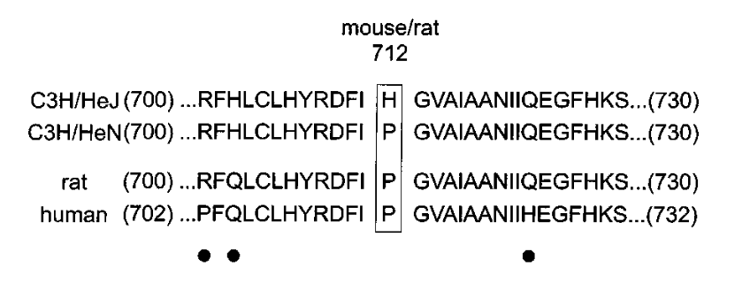
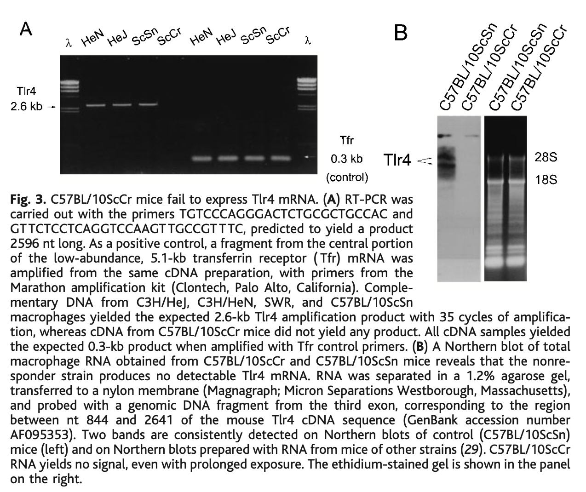

```{r setup, include=FALSE}
knitr::opts_chunk$set(collapse = TRUE)
```


```{r, echo = FALSE}
bytes <- file.size("index.Rmd")
words <- bytes/10
minutes <- words/200
```

<span style="font-size:15px;">这是对原文的翻译和解读，纠错和讨论请发邮件至 hongchl3@outlook.com。<br/>
原文链接: [Defective LPS Signaling in C3H/HeJ and C57BL/10ScCr Mice: Mutations in Tlr4 Gene](https://doi.org/10.1126/science.282.5396.2085)</span>

---

<!-- setwd("~/R/hongchaoli.cn/content/post/2023-12-07-1998-science-bruce-beutler-lps-tlr4/pictures") -->


```{r, echo=FALSE, fig.cap=" ", out.width = '100%'}
knitr::include_graphics("pictures/title.png")
```


```{r, echo=FALSE, fig.cap=" ", out.width = '100%'}
knitr::include_graphics("pictures/fig.1.png")
```


```{r, echo=FALSE, fig.cap=" ", out.width = '100%'}

```

```{r, echo=FALSE, fig.cap=" ", out.width = '100%'}

```

```{r, echo=FALSE, fig.cap=" ", out.width = '100%'}
knitr::include_graphics("pictures/fig.4.png")
```


