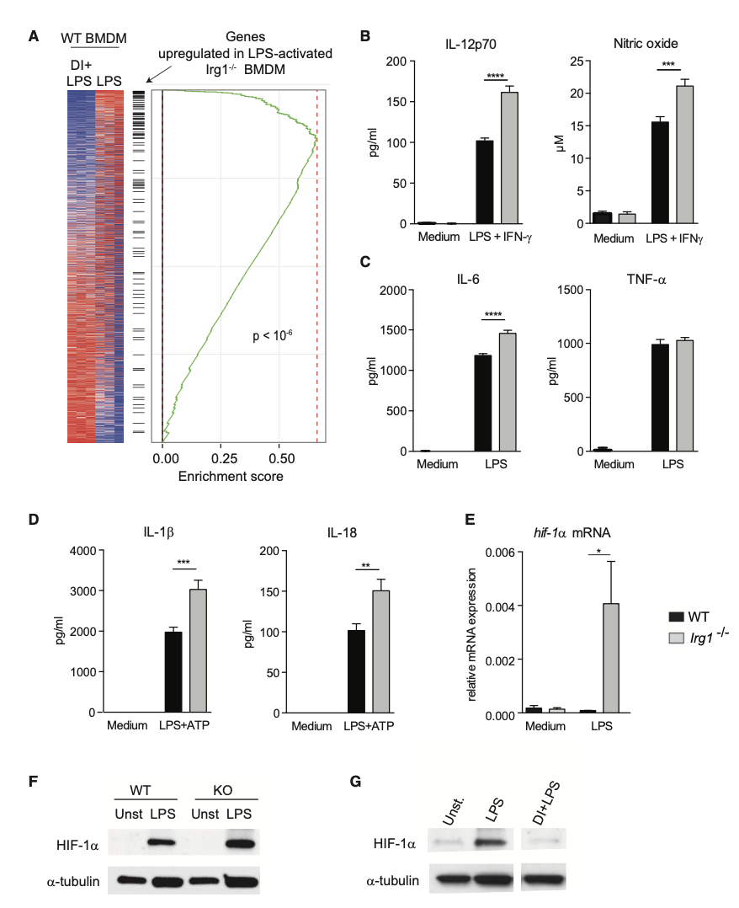

```{r setup, include=FALSE}
knitr::opts_chunk$set(collapse = TRUE)
```

```{r, echo = FALSE}
bytes <- file.size("index.Rmd")
words <- bytes/4
minutes <- round(words/200)
```

<font color=DarkGray face='Microsoft YaHei'>阅读时长大约 `r minutes` 分钟</font>

<span style="font-size:15px;">这是对原文的翻译和解读，纠错和讨论请发邮件至 hongchl3@outlook.com。<br/>
原文链接: [Itaconate Links Inhibition of Succinate Dehydrogenase with Macrophage Metabolic Remodeling and Regulation of Inflammation](https://www.ncbi.nlm.nih.gov/pmc/articles/PMC5108454/)</span>

---

<center>
# 导读
</center>

巨噬细胞经历炎症激活时会发生代谢过程的变化，如TCA循环的改变。在这一过程中，内源性的代谢产物能发挥调节炎症反应的作用，琥珀酸就被发现能调节IL-1$\beta$-HIF-1$\alpha$这一促炎通路。衣康酸是巨噬细胞被激活时大量产生的代谢产物之一，但它在其中发挥的功能还不清楚。这篇文章利用*Irg1*敲除小鼠（*Irg1*编码乌头酸脱羧酶1，催化衣康酸的生成反应），揭示了在巨噬细胞被激活时，衣康酸调节琥珀酸的水平和功能、线粒体呼吸以及促炎细胞因子的产生。

```{r, echo=FALSE, fig.cap=" ", out.width = '100%'}

```

---

巨噬细胞在接受LPS + IFN-$\gamma$刺激24小时后，负责生成衣康酸的酶——Irg1，是上调最显著的酶之一，细胞内和细胞外的衣康酸水平也显著升高。通过添加生理水平的外源性衣康酸二甲酯（DI），本研究发现DI显著抑制了LPS + IFN-$\gamma$诱导产生的iNOS、IL-12p70和IL-6，而TNF-$\alpha$水平未发生变化，说明DI并非通过抑制NF-$\kappa$b依赖的基因表达来发挥作用。通过RNA-seq，本研究发现DI抑制了多个LPS刺激下上调的基因：*Il1b*, *Il18*, *P2rx7*, *Casp1*和*Pycard* (ASC)。确实，DI显著抑制了LPS + ATP、LPS + 尼日利亚菌素和LPS + 尿酸盐结晶诱导产生的成熟的IL-1$\beta$和IL-18。此外，DI显著抑制了LPS和LPS + ATP刺激下的NLRP3和ASC蛋白水平，说明衣康酸对炎症小体功能的抑制主要在起始阶段。
```{r, echo=FALSE, fig.cap="衣康酸在巨噬细胞激活过程中发挥抗炎作用", out.width = '100%'}

```


由于文献表明细胞代谢的变化可抑制IL-1$\beta$的产生和炎症小体的激活，本研究进一步利用计算机模型分析衣康酸对代谢的影响。预测结果表明，衣康酸可能增加乳酸脱氢酶的产生。确实，衣康酸显著升高了细胞外酸化指数（ECAR），表明存在乳酸堆积。第二个预测结果表明衣康酸可能降低Sdh介导的代谢流。实验结果证实，衣康酸以剂量依赖的形式抑制Sdh活性，增加琥珀酸水平。

进一步，本研究发现，静脉给予DI显著降低了心脏缺血再灌注损伤模型的心肌梗死面积。对体外培养的心肌细胞施加缺氧刺激可以诱导ROS的产生，而给予DI显著抑制了ROS的产生和缺氧诱导的细胞死亡。此外，DI也显著抑制了BMDM在LPS刺激下产生的线粒体ROS（mROS）。
```{r, echo=FALSE, fig.cap="衣康酸在体内和体外抑制琥珀酸脱氢酶（Sdh）活性，并在缺血再灌注损伤中缓解ROS介导的组织损伤", out.width = '100%'}

```


为了验证内源性衣康酸的功能，本研究繁育了*Irg1*敲除小鼠。*Irg1*敲除后，BMDM在LPS或LPS + IFN-$\gamma$刺激下不再产生或分泌衣康酸，说明Irg1是在这些条件下生成衣康酸的唯一关键酶。BMDM在LPS刺激下，琥珀酸、延胡索酸和苹果酸的水平显著升高。而Irg1敲除显著抑制了琥珀酸的增加、显著增强了延胡索酸和苹果酸的增加。该实验证实了衣康酸对Sdh的抑制作用。

此外，巨噬细胞在受到LPS刺激时，线粒体呼吸被显著抑制。而敲除*Irg1*显著增加了耗氧率（OCR），说明衣康酸发挥调控线粒体呼吸的功能。
```{r, echo=FALSE, fig.cap="内源性衣康酸控制TCA循环重塑和琥珀酸水平", out.width = '100%'}

```


对WT BMDM和*Irg1*敲除BMDM进行RNA-seq，结果表明*Irg1*敲除的结果与施加外源性DI的结果正好相反：在*Irg1*敲除BMDM中上调的基因，正好是施加外源性DI的BMDM中下调的基因，说明体外施加的DI与内源性衣康酸发挥类似功能。此外，*Irg1*敲除BMDM在LPS刺激下生成的IL-12、NO和IL-6显著更高，而TNF-$\alpha$没有受到影响。在LPS + ATP刺激下，*Irg1*敲除BMDM产生了更高水平的IL-1$\beta$和IL-18。*Irg1*敲除BMDM在LPS刺激下的HIF-1$\alpha$的mRNA和蛋白水平均显著更高，而给予外源性DI显著抑制了HIF-1$\alpha$的蛋白水平。上述结果提示，HIF-1$\alpha$-IL-1$\beta$轴可能与巨噬细胞的电子传递链的效能和方向有关，而不是与琥珀酸堆积导致的直接通路有关。
```{r, echo=FALSE, fig.cap="*Irg1*敲除巨噬细胞在LPS刺激下表现为显著增强的的炎症反应", out.width = '100%'}

```


综上，该研究证实了衣康酸通过抑制Sdh和增加琥珀酸水平，调节TCA循环重塑和巨噬细胞的激活，尤其是调节Toll样受体介导的炎症因子的产生。


