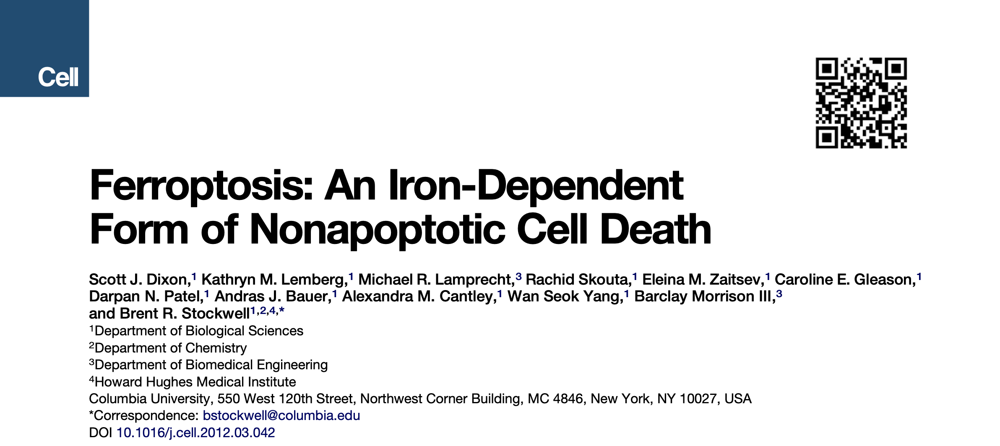
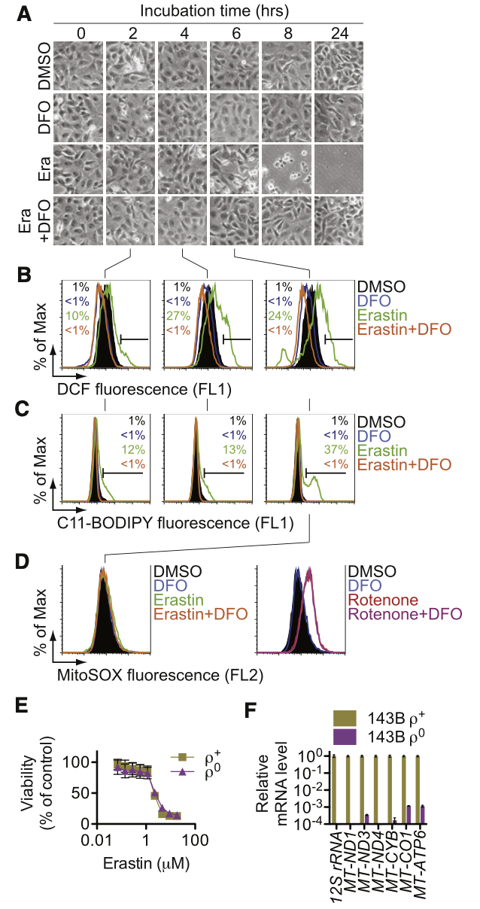
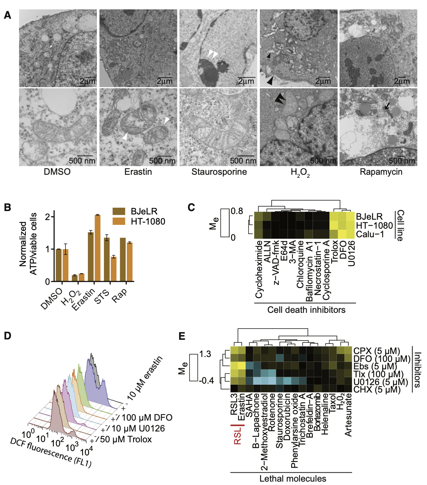
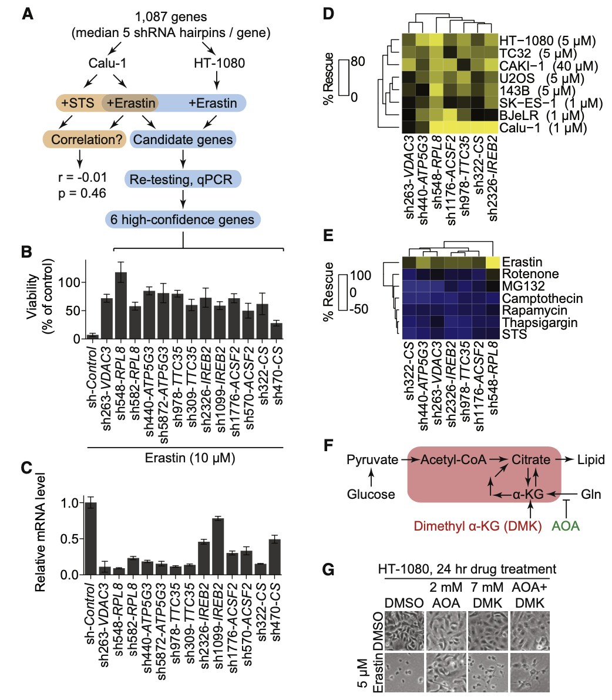
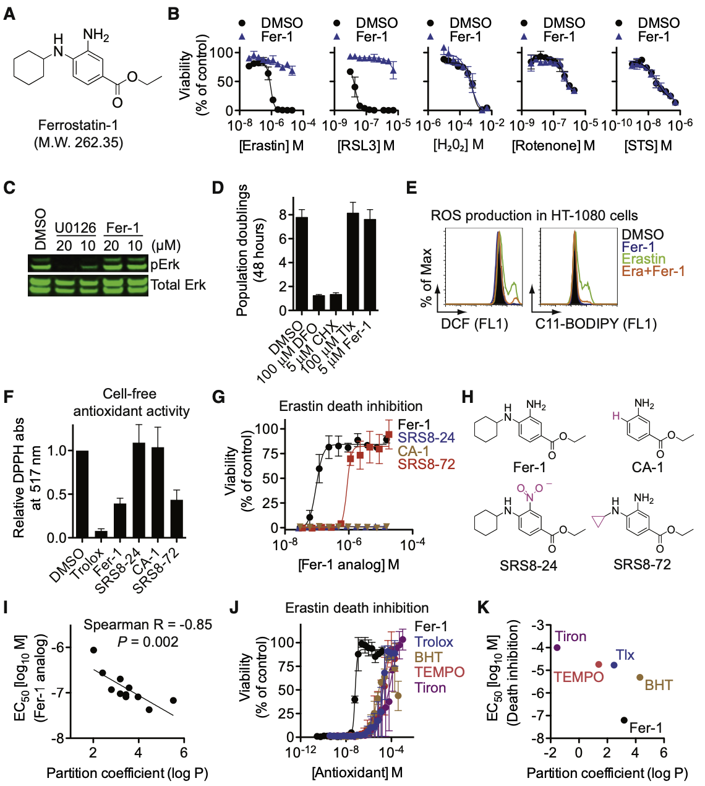
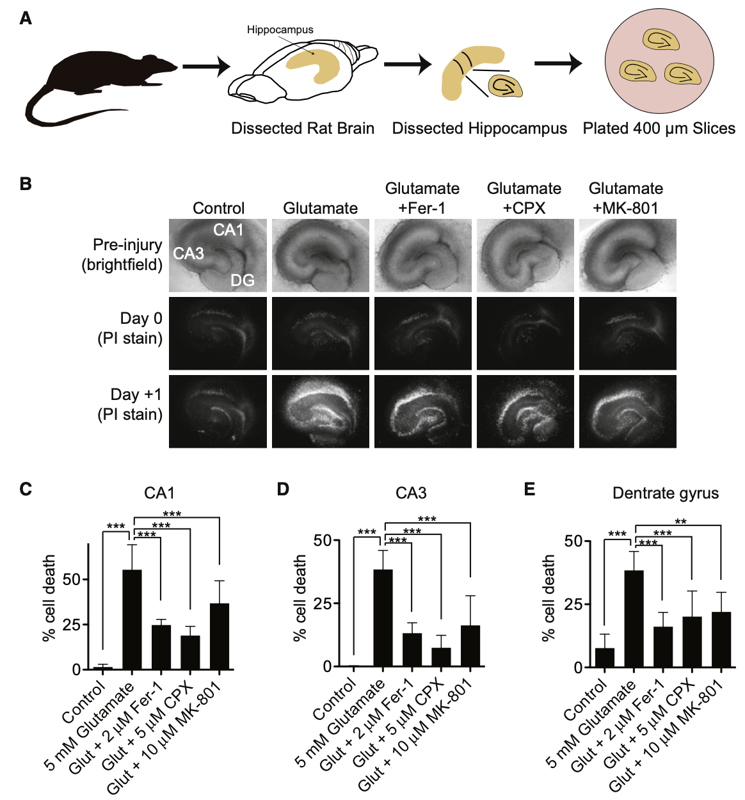
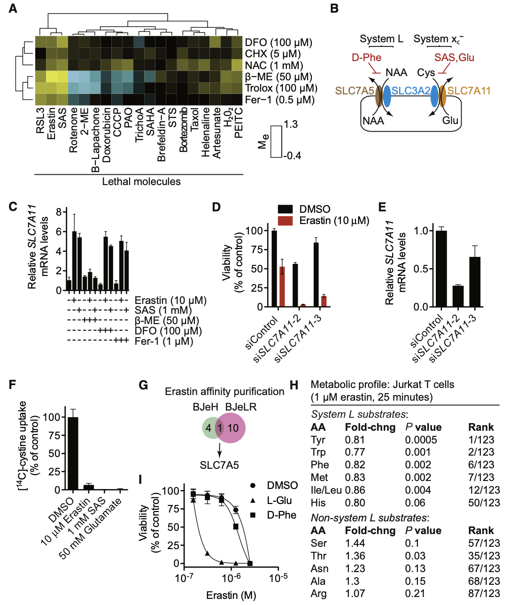
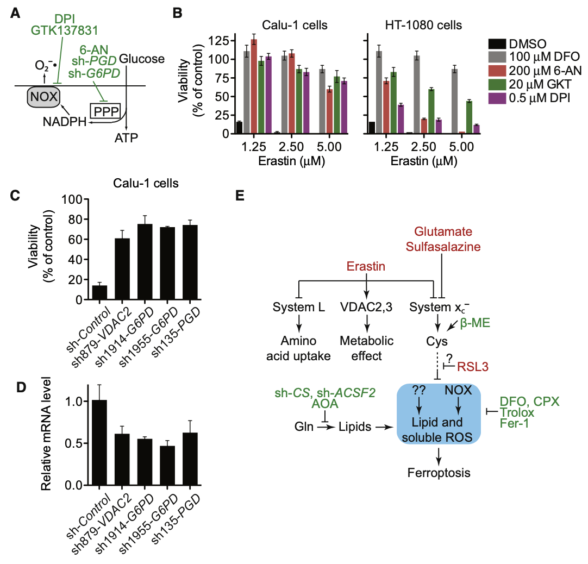

```{r setup, include=FALSE}
knitr::opts_chunk$set(collapse = TRUE)
```

```{r, echo = FALSE}
bytes <- file.size("index.Rmd")
words <- bytes/4
minutes <- round(words/200)
```


<font color=DarkGray face='Microsoft YaHei'>阅读时长大约 `r minutes` 分钟</font>

<span style="font-size:15px;">这是对原文的翻译和解读，纠错和讨论请发邮件至 hongchl3@outlook.com。<br/>
原文链接: [Ferroptosis: An Iron-Dependent Form of Nonapoptotic Cell Death](https://www.cell.com/fulltext/S0092-8674(12)00520-X)</span>

---

<center>
# 导读
</center>

一直从不同的渠道听到“铁死亡”这个概念，今天才真正去查文献，认真扫盲。

2012年，哥伦比亚大学Brent R. Stockwell课题组在Cell发表了这篇文章，首次提出“ferroptosis（铁死亡）”这一概念。他们发现，铁死亡是一种依赖于胞内铁离子，并且不同于凋亡（apoptosis）、坏死（necrosis）和自噬（autophagy）的一种新型细胞死亡方式。
```{r, echo=FALSE, fig.cap=" ", out.width = '100%'}

```

整篇文章正文一共7张大图，一起来看一下这篇文章是怎么发现这种死亡方式的吧。

---

细胞死亡对于机体正常的发育和稳态以及抑制过度增殖至关重要。曾经学术界认为哺乳细胞中几乎所有的调控性死亡都是由于caspase依赖的细胞凋亡的激活。之后多种新型的程序性死亡方式被陆续发现，比如PARP-1和AIF-1依赖的细胞死亡（Parthanatos）、caspase-1依赖的细胞焦亡（pyroptosis）、RIPK-1依赖的坏死性凋亡（necroptosis）。那是不是还有其他等待我们去发现的细胞死亡方式呢？

小GTP酶的RAS家族（HRAS、NRAS、KRAS）的突变存在于大约30%的肿瘤中，因此寻找能特异性杀伤RAS突变肿瘤细胞的化合物至关重要。该课题组之前鉴定出了erastin这一化合物能够特异性杀伤RAS突变肿瘤细胞，并且VDAC2和VDAC3对于erastin的杀伤作用是必要但不充分的，这说明erastin还有其他重要的靶标没有被发现。

erastin诱导细胞死亡的机制仍然是未解之谜。这一细胞死亡过程中并没有出现细胞凋亡的典型特征，如线粒体细胞色素C的释放、caspase的激活或染色质的片段化。但是，这一过程伴随着细胞内ROS水平的升高，并且可以被铁螯合剂或细胞铁吸收抑制剂所抑制。这种铁依赖的细胞死亡方式是非常少见的。

因此，这篇文章认为erastin诱导的细胞死亡可能是一种全新的细胞死亡方式，并且将这种死亡命名为“ferroptosis”。

---

<center>
## 实验结果
</center>

### erastin诱导了过氧化和铁依赖的细胞死亡

首先，erastin处理NRAS突变HT-1080纤维肉瘤细胞后，细胞从6h开始出现显著的死亡。利用H~2~DCFDA和C11-BODIPY荧光探针分别考察胞质ROS和脂质ROS水平，流式结果表明胞质ROS和脂质ROS从2h就开始显著升高。ROS的积累和细胞死亡均被铁离子螯合剂DFO所取消。此外，3种不同外源性铁均显著增强了erastin诱导的细胞死亡，而其他金属离子没有这种增强作用。

进一步，研究人员猜想ROS的累积是否来源于线粒体电子传递链（ETC）。出乎意料的是，MitoSOX荧光所指示的线粒体ROS水平并没有升高，而且ETC复合物I抑制剂rotenone升高线粒体ROS水平的作用不能被铁离子螯合剂DFO所拮抗。另一个强有力的实验结果是，由于缺少线粒体DNA转录产物导致不能产生功能性ETC的一种细胞系——KRAS突变143B骨肉瘤细胞，仍然能被erastin诱导死亡。上述实验结果充分说明了erastin导致的胞内ROS累积并不是来源于线粒体ETC。
 
```{r, echo=FALSE, fig.cap="erastin诱导细胞死亡时伴随着胞质ROS的累积，这一ROS累积可被DFO所抑制", out.width = '100%'}

```

### 铁死亡不同于其他已知的细胞死亡方式

研究人员进一步利用电镜观察erastin对亚细胞结构和形态的影响。结果发现，erastin处理细胞后并没有出现与其他细胞死亡方式类似的形态改变。比如STS诱导细胞凋亡会出现染色质聚集和边缘化，过氧化氢诱导细胞坏死会出现细胞膜和细胞器肿胀和质膜破裂，雷帕霉素诱导自噬会出现双层膜包裹的囊泡的形成，而这些形态在erastin处理的细胞中均没有出现。此外，erastin也没有导致细胞内ATP水平的下降，而胞内ATP的下降是细胞坏死的特征性改变。

进一步，研究人员考察了12种小分子细胞死亡抑制剂对erastin作用的影响，发现DFO（铁离子螯合剂）、trolox（抗氧化剂）、U0126（MEK抑制剂）和CHX（蛋白合成抑制剂）能够抑制erastin诱导的细胞死亡。这些小分子均抑制了erastin导致的胞内ROS水平的升高。相反，caspase抑制剂、RIPK1抑制剂、cyclophilin D、溶酶体功能或自噬相关分子的抑制剂均不能缓解erastin导致的细胞死亡。反过来，DFO、trolox、U0126和CHX这些能抑制erastin导致的细胞死亡的小分子药物也不能抑制其他细胞死亡方式。这些结果共同说明了erastin诱导的细胞死亡不同于细胞凋亡、细胞坏死和自噬。

```{r, echo=FALSE, fig.cap="erastin发挥氧化导致细胞死亡的作用依赖于铁", out.width = '100%'}

```

### 铁死亡独特的基因表达谱

为了从基因表达层面理解铁死亡，研究人员鉴定了铁死亡过程需要的关键基因。由于电镜结果表明erastin导致了线粒体体积的缩小和密度的增高，研究人员着重考察了线粒体基因。利用靶向1087个基因的shRNA库，研究人员比较了抑制erastin诱导的铁死亡和抑制STS诱导的细胞凋亡的shRNA群，结果表明这两个shRNA群没有显著相关性，这也说明了铁死亡的基因表达谱与细胞凋亡完全不同。

进一步，研究人员通过筛选和qPCR验证等实验设计，找到了6个铁死亡所必需的基因：*RPL8*、*IREB2*、*ATP5G3*、*CS*、*TTC35*和*ACSF2*。利用靶向这6个基因的shRNA分别处理8个不同的细胞系，均不同程度地抑制了erastin诱导的细胞死亡，但是对其他细胞死亡方式没有抑制作用。这些结果表明铁死亡所依赖的基因表达网络不同于其他任何死亡方式。

*ACSF2*和*CS*均与线粒体脂肪酸代谢的调控相关。肿瘤细胞中脂肪酸的合成部分依赖于谷氨酰胺转变为$\alpha$-酮戊二酸，这一过程可被转氨酶抑制剂AOA所抑制。确实，AOA显著抑制了erastin诱导的细胞死亡，而补充二甲基$\alpha$-酮戊二酸（DMK）取消了AOA的这一作用。上述结果说明谷氨酰胺、CS和ACSF2依赖的脂质合成可能为铁死亡提供了某些必要的脂质前体。

```{r, echo=FALSE, fig.cap="erastin诱导的铁死亡具有独特的基因表达谱", out.width = '100%'}

```

### ferrostatin-1是铁死亡的小分子抑制剂

（看了这部分，希望自己下辈子能好好学化学😂）<br/>
为了找到能够抑制铁死亡的强效小分子药物，研究人员从市面上可获得的3,372,615种化合物中定制了9517种小分子筛选库，从中筛选并进行实验验证，最终找到了ferrostatin-1（Fer-1）这一铁死亡最有效的抑制剂，它在HT-1080细胞中抑制铁死亡的EC~50~为60 nM。

研究人员合成了Fer-1，并且验证了Fer-1特异性地抑制erastin诱导的铁死亡，而对细胞凋亡等死亡方式没有影响。

进一步探究Fer-1的作用机制，研究人员发现Fer-1并不影响MEK/ERK信号通路、铁的螯合或蛋白合成，但是显著抑制了erastin导致的胞内ROS的累积。与Trolox这一抗氧化剂类似，Fer-1也有很强的抗氧化功能。用硝基取代一级芳香胺（SRS8-24）或去掉N-环己基（CA-1）后取消了Per-1抑制铁死亡的作用。因此，芳香胺可能是Per-1清除自由基从而抑制铁死亡的关键结构。

结合前述实验结果，研究人员提出假设：Fer-1可能通过N-环己基结构在生物膜中作为亲脂性锚点，清除脂质ROS。对此，研究人员合成了10种具有不同碳原子数的Fer-1类似物，发现这些类似物的预测亲脂性（辛醇-水分配系数，log P）与抑制铁死亡的能力之间具有显著相关性。其中值得注意的是，用N-环丙基取代N-环己基（SRS8-72）后，抑制铁死亡的能力降低了一个数量级，但是抗氧化能力仍然相当。因此，N-环己基结构可能是促进Per-1与脂膜的交联，而不是影响其内在抗氧化能力。

有趣的是，亲脂性似乎不足以解释Per-1抑制铁死亡的作用。Per-1的预测脂溶性与trolox和BHT这两种典型的脂溶性抗氧化剂相似，但是抑制铁死亡的效力却高得多。trolox和BHT属于酚类，而Per-1含有芳香胺，这可能赋予了Per-1特有的抑制铁死亡的剧烈反应特性。

```{r, echo=FALSE, fig.cap="ferrostatin-1（Fer-1）的鉴定和特征解析", out.width = '100%'}

```

### Per-1可抑制谷氨酸诱导的神经兴奋性毒性
（这部分好读多了）<br/>
神经系统在癫痫、脑卒中或其他脑创伤时会发生神经兴奋性毒性，这一过程被报道依赖于过氧化和铁离子。研究人员假设神经兴奋性毒性可能与erastin诱导的铁死亡具有相似性。通过制备离体海马脑片，并用毒性剂量谷氨酸 ± Fer-1/CPX（铁螯合剂）/MK-801（NMDA受体拮抗剂）处理脑片，研究人员发现Per-1显著抑制了谷氨酸诱导的细胞死亡。该结果表明，谷氨酸诱导的神经兴奋性毒性与erastin诱导的铁死亡具有类似的作用机制。

```{r, echo=FALSE, fig.cap="Fer-1在体外海马脑片中对兴奋性细胞死亡的作用", out.width = '100%'}

```

### erastin抑制胱氨酸/谷氨酸反向转运体（System X~c~^-^）

研究人员进一步探究了erastin诱导的铁死亡与谷氨酸诱导的神经兴奋性毒性之间其他的共享机制。

已知谷氨酸诱导的神经兴奋性毒性依赖于离子通道型谷氨酸受体介导的钙离子内流或谷氨酸竞争性抑制胱氨酸/谷氨酸反向转运体（System X~c~^-^）介导的胱氨酸向胞内的转运。钙离子螯合剂对erastin诱导的细胞死亡没有影响，所以前者不太可能参与erastin诱导的铁死亡。但是，System X~c~^-^的抑制剂SAS的小分子抑制剂的热图与erastin高度一致，$\beta$-巯基乙醇（SAS作用的抑制剂）显著抑制了erastin诱导的细胞死亡。

System X~c~^-^是由SLC7A11和SLC3A2组成的异二聚体，抑制System X~c~^-^会导致SLC7A11转录的补偿性上调。研究结果表明，erastin和SAS一样，会显著上调SLC7A11表达水平，干扰SLC7A11后显著增强了erastin的细胞杀伤能力。并且，[14C]-cystine摄取实验也直接表明了，erastin会抑制细胞对胱氨酸的摄取。

```{r, echo=FALSE, fig.cap="erastin抑制胱氨酸/谷氨酸反向转运体（System X~c~^-^）活性", out.width = '100%'}

```


### NADPH氧化酶是erastin诱导细胞死亡时ROS的来源之一

抑制System X~c~^-^会导致胱氨酸介导的谷胱甘肽合成以及跨膜胱氨酸氧化还原穿梭系统的障碍，从而损害细胞的抗氧化防御体系。由于前面的研究已经排除了线粒体ETC来源的ROS，研究人员聚焦了NADPH氧化（NOX）在erastin诱导的细胞死亡中的作用。NOX抑制剂DPI、NOX1/4选择性抑制剂GKT137831、戊糖磷酸途径抑制剂6-AN均显著抑制了erastin诱导的细胞死亡。

```{r, echo=FALSE, fig.cap="NOX在erastin诱导的细胞死亡中的作用", out.width = '100%'}

```


全文读下来，我觉得生物之中处处是化学。

完结撒花✿✿ヽ(°▽°)ノ✿ 😉


